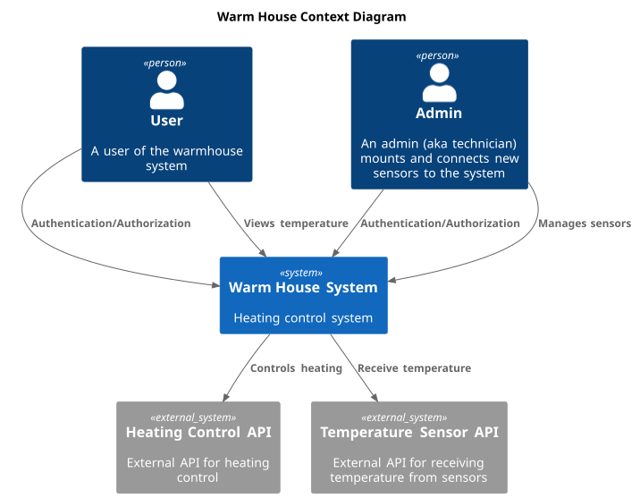
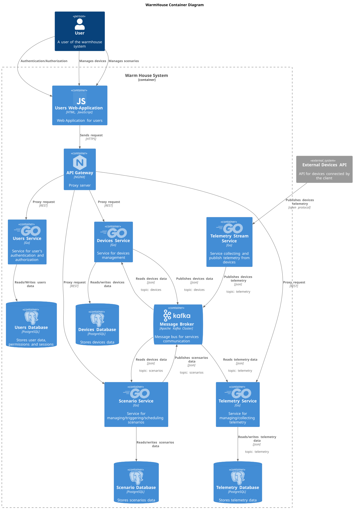
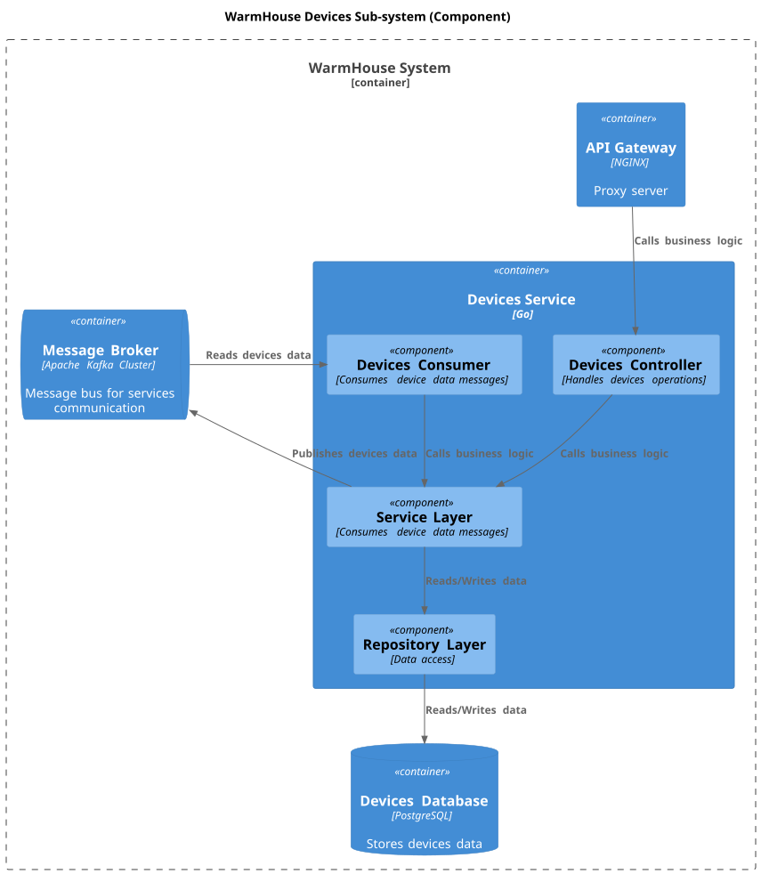
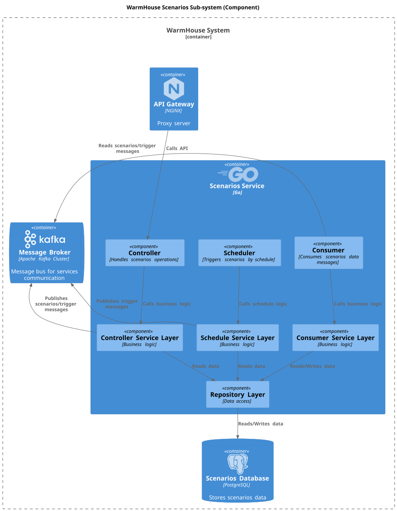
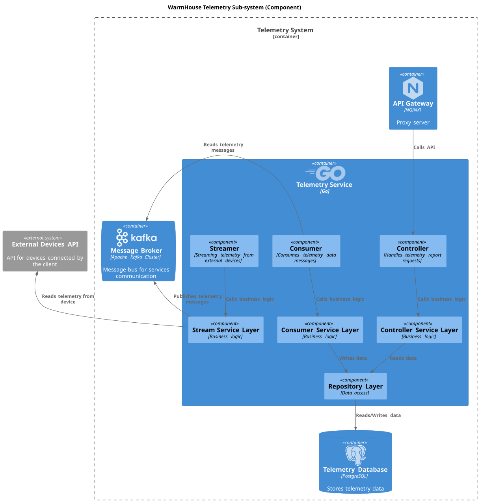
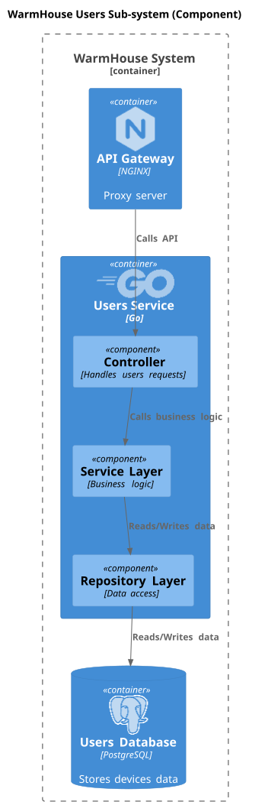
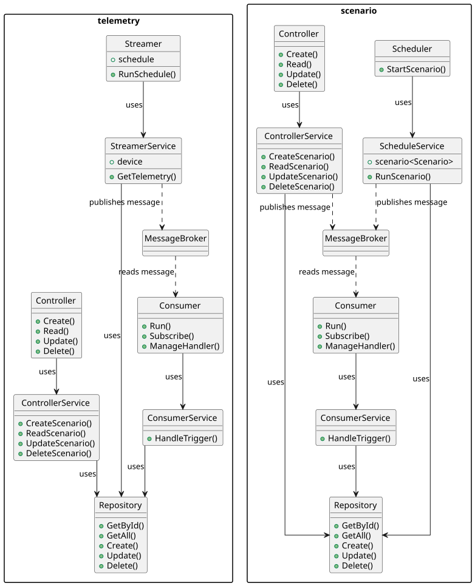
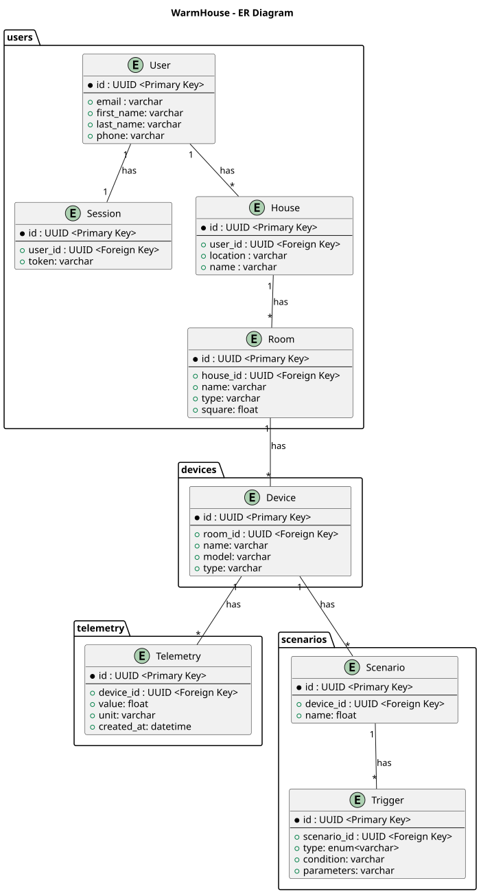

# Project_template

Это шаблон для решения проектной работы. Структура этого файла повторяет структуру заданий. Заполняйте его по мере работы над решением.

# Задание 1. Анализ и планирование

<aside>

Чтобы составить документ с описанием текущей архитектуры приложения, можно часть информации взять из описания компании и условия задания. Это нормально.

</aside>

### 1. Описание функциональности монолитного приложения

**Управление отоплением:**

- Пользователи могут удалённо включать и выключать отопление в своих домах.
- Система поддерживает: создание, получение, обновление, удаление датчиков. 

**Мониторинг температуры:**

- Пользователи могут просматривать текущую температуру в своих домах через веб-интерфейс.
- Пользователи не могут самостоятельно подключить свой датчик, поэтому каждая установка сопровождается выездом специалиста по подключению.
- Система поддерживает получение температуры с датчиков в домах. Так же система поддерживает обновление значения датчиков.

### 2. Анализ архитектуры монолитного приложения

Язык программирования - GO.

База данных - PostgreSQL.

Архитектура проекта монолитная, поэтому имеем ограниченную масштабируемость. Так же все компоненты находятся в рамках одного приложения.

Взаимодействие с приложением синхронное, запросы к API отрабатывают последовательно.

Обновление приложения производится через остановку всего приложения, отдельные части приложения обновить невозможно.

### 3. Определение доменов и границы контекстов

#### As-Is

1. Домен: Пользователи
    - Поддомен: Личный кабинет
        - Контекст: Аутентификация
    - Поддомен: Ролевая система
        - Контекст: Авторизация
2. Домен: Отопление
   - Поддомен: Управление отоплением
      - Контекст: Включение/выключение отопления
   - Поддомен: Мониторинг температуры
      - Контекст: Получение температуры с датчиков
3. Домен: Датчики
   - Поддомен: Подключение/отключение датчиков
     - Контекст: Создание/обновление/удаление датчиков

#### To-Be

1. Домен: Пользователи
    - Поддомен: Личный кабинет пользователя
      - Контекст: Аутентификация
    - Поддомен: Ролевая система
      - Контекст: Авторизация
2. Домен: Устройства
    - Поддомен: Управление устройствами
      - Контекст: Создание/Получение/Обновление/Удаление устройств
3. Домен: Сценарии устройств
   - Поддомен: Редактор сценариев
     - Контекст: Написание/программирование сценариев для устройств
   - Поддомен: Запуск сценариев
     - Контекст: Запуск пользовательских сценариев для отправки сигналов/запросов на устройство по стандартным протоколам
4. Домен: Телеметрия
   - Поддомен: Сборщик телеметрии
     - Контекст: Сбор телеметрии с устройств для истории
   - Поддомен: Анализ телеметрии
     - Контекст: Предоставление графиков/исторических данных телеметрии

### **4. Проблемы монолитного решения**

- Монолитная архитектура плохо поддаётся масштабированию: нельзя масштабировать конкретные части приложения, приходится масштабировать всё приложение полностью.
- Увеличивается срок вывода функционала в прод из-за сильной связанности компонентов приложения.
- Downtime во время обновления функционала приложения: для поставки нового функционала требуется полный перезапуск приложения.
- Если в одном из экземпляров приложения что-то сломается, то есть риск того, что экземпляр выйдет из строя.
- Трудозатраты на тестирование увеличены, так как гораздо сложней тестировать отдельные части приложения (вместо этого приходится тестировать всё приложение полностью)
- Нет возможности предоставить SaaS пользователю.

### 5. Визуализация контекста системы — диаграмма С4

[Диаграмма контекста](schemas/as_is/context.puml)

# Задание 2. Проектирование микросервисной архитектуры

В этом задании вам нужно предоставить только диаграммы в модели C4. Мы не просим вас отдельно описывать получившиеся микросервисы и то, как вы определили взаимодействия между компонентами To-Be системы. Если вы правильно подготовите диаграммы C4, они и так это покажут.

**Диаграмма контейнеров (Containers)**

[Диаграмма контейнеров системы](schemas/to_be/containers.puml)

**Диаграмма компонентов (Components)**

[Диаграмма компонентов устройств](schemas/to_be/components/devices.puml)

[Диаграмма компонентов сценариев](schemas/to_be/components/scenarios.puml)

[Диаграмма компонентов телеметрии](schemas/to_be/components/telemetry.puml)

[Диаграмма компонентов пользователей](schemas/to_be/components/users.puml)

**Диаграмма кода (Code)**

[Диаграмма кода](schemas/to_be/code.puml)

# Задание 3. Разработка ER-диаграммы

[ER-Диаграмма](schemas/to_be/er.puml)

# Задание 4. Создание и документирование API

### 1. Тип API

В новой архитектуре будет использоваться REST API, так как основное взаимодействие у пользователя с API будет заключаться в CRUD-операциях. Всё остальное взаимодействие между микросервисами будет происходить асинхронно через брокер сообщений.

### 2. Документация API

[Документация API](docs/openapi.yaml)

# Задание 5. Работа с docker и docker-compose

[Temperature-api](apps/temperature-api)

# **Задание 6. Разработка MVP**

Пропустил задание, не успеваю